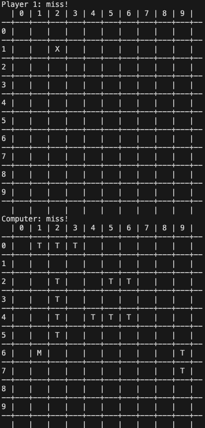

# Battle of Tanks game

    A Java implementation of a simple game called battle of tanks, for one player vs. computer, or two players. The game is similar to the <a href="https://en.wikipedia.org/wiki/Battleship_(game)">Battleship game</a>.
    <!-- [Battleship game](https://en.wikipedia.org/wiki/Battleship_(game)). -->

## Description

    Each player has a 10*10 map. At the beginning, each player places five tanks on the map by specifying the coordinates of the origin of the tank and the tank's direction (vertically/horizontally). The width of a tank is 1 and its length should be an integer number in [2,5]. The player does not know the locations of the opponent's tanks. Players take turns shooting at the opponent's tanks by entering the coordinates of a point from the opponent's map. If on that point a part of a tank exists, the part will be hit. Whenever all parts of the tank are hit, the tank will completely be destroyed. The winner is the one who destroys all the opponent's tanks.

